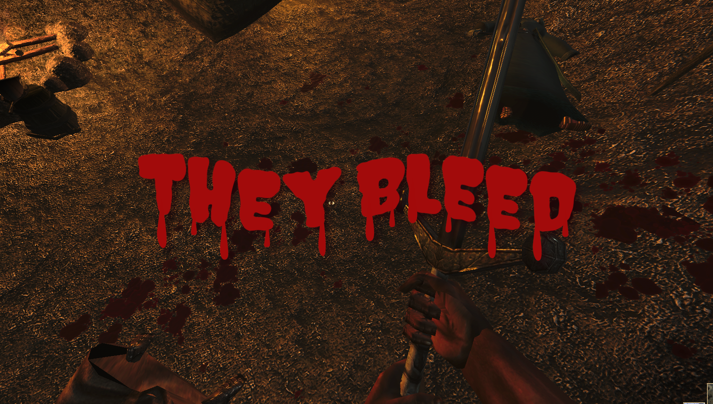

# ♦ They Bleed

The spoils of war taint your surroundings; your violence now leaves bloodied marks on the environment. Low-HP players/NPCs also leave subtle blood trails.

 

## ♦ How to install

- **Requires OpenMW 0.51 or newer.**
- Install it like any other OpenMW mod and enable `TheyBleed.omwscripts` in the "Content Files" tab of the OpenMW launcher. If this is your first OpenMW mod, [read this tutorial](https://modding-openmw.com/tips/installing-mods/).
- Settings are in Options -> Scripts -> They Bleed.

The blood comes with PBR maps made for [Wareya's PBR shaders](https://github.com/wareya/OpenMW-PBR), so it looks wet and glossy with them. It _might_ (or might not) look wrong with [Rafael's shaders](https://www.nexusmods.com/morrowind/mods/53667) or other shaders that read these maps differently. If the blood looks off, delete the `*_spec.dds` files from `textures/MaxYari/TheyBleed/` (they hold the metalness and roughness). The normal maps (`*_n.dds`) are fine and can stay.

To uninstall, set "Max Decals" to 0 and save your game first, so no blood is left behind in your save. Then uninstall the mod.

## ♦ Compatibility

- [Diverse Blood](https://www.nexusmods.com/morrowind/mods/45368) is supported: blue, green, dark and orange blood leave decals of matching colour. Dust, sparks and energy leave none.
- Should work with any mod that doesn't replace OpenMW's built-in combat blood effect.

## ♦ AI disclaimer

Made with HEAVY AI assistance. Only this mod's logo was made completely by human hands, and, well, I also picked out myself that little sound that you might hear when the blood droplets hit the environment. The rest was just working with a coding AI, testing and correcting.

